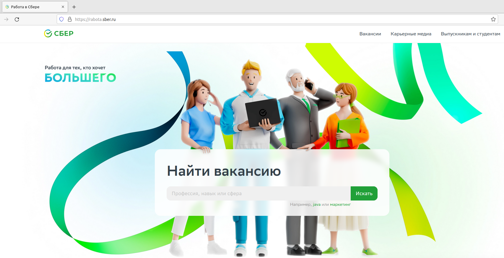
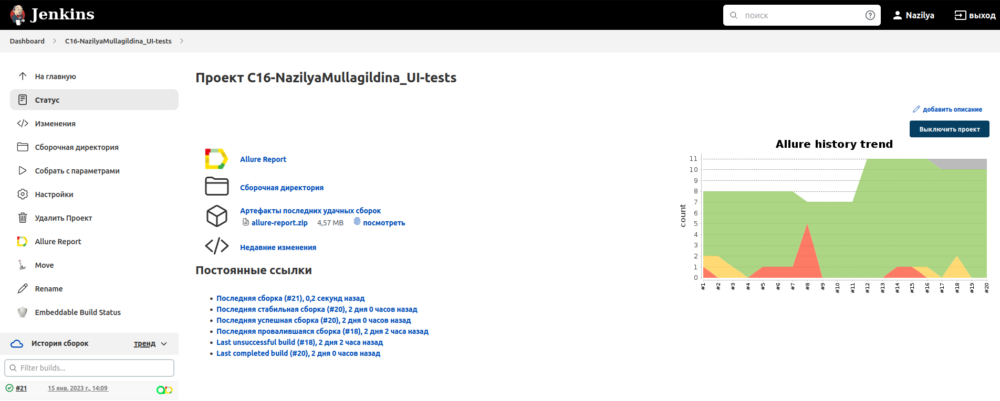
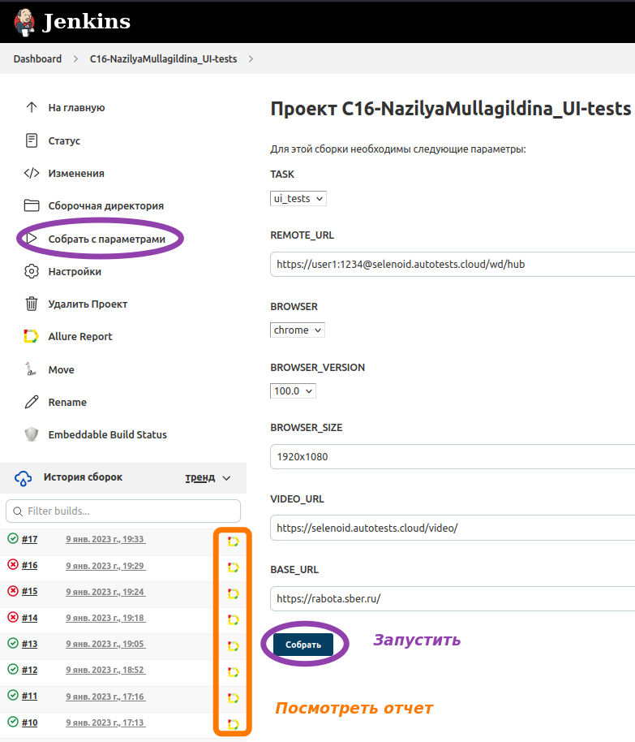

# Проект по автоматизации тестирования
<a target="_blank" href="https://rabota.sber.ru/">Веб сайт Работа в Сбере</a>

<p align="center">

</p>

## :maple_leaf: Содержание:

- [Технологии и инструменты](#earth_africa-технологии-и-инструменты)
- [Реализованные проверки](#earth_africa-Реализованные-проверки)
- [Сборка в Jenkins](#earth_africa-Jenkins-job)
- [Запуск из терминала](#earth_africa-Запуск-тестов-из-терминала)
- [Allure отчет](#earth_africa-Allure-отчет)
- [Отчет в Telegram](#earth_africa-Уведомление-в-Telegram-при-помощи-бота)
- [Видео примеры прохождения тестов](#earth_africa-Примеры-видео-о-прохождении-тестов)

## :maple_leaf:Технологии и инструменты

<p align="center">
<a href="https://www.jetbrains.com/idea/"></a>
<a href="https://www.java.com/"></a>
<a href="https://github.com/"></a>
<a href="https://junit.org/junit5/"></a>
<a href="https://gradle.org/"></a>
<a href="https://selenide.org/"></a>
<a href="https://aerokube.com/selenoid/"></a>
<a href="https://github.com/allure-framework/allure2"></a>
<a href="https://www.jenkins.io/"></a>
</p>

## :maple_leaf: Список проверок, реализованных в автотестах

✓ Проверка кликабельности элементов меню на главной станице
✓ Поиск вакансии QA Automation
✓ Поиск вакансий (параметризованные тесты)
✓ Поиск вакансии с использованием фильтров
✓ Заполнение формы для отклика на вакансию

## :maple_leaf: Запуск тестов

### :maple_leaf: Локальный запуск :
```
gradle clean test
```

### :maple_leaf: Удаленный запуск:
```
clean
ui_tests
-Dbase_url=${BASE_URL}
-DremoteUrl=${REMOTE_URL}
-Dbrowser=${BROWSER}
-DbrowserVersion=${BROWSER_VERSION}
-DbrowserSize=${BROWSER_SIZE}
```

### </a> Запуск через  <a target="_blank" href="https://jenkins.autotests.cloud/job/C16-NazilyaMullagildina_UI-tests/"> Jenkins </a>

### :maple_leaf: Параметры сборки в Jenkins:

- запуск тестов с тегом ui_tests (по умолчанию)
- browser (браузер, по умолчанию chrome)
- version (версия браузера, по умолчанию 100.0)
- size (размер окна браузера, по умолчанию 1920x1080)
- remoteUrl (логин, пароль и адрес удаленного сервера selenoid)
- BASE_URL (https://rabota.sber.ru/ - по умолчанию)

<p align="center">
<a href="https://jenkins.autotests.cloud/job/C16-NazilyaMullagildina_UI-tests/"></a>
</p>

<p align="center">
<a href="https://jenkins.autotests.cloud/job/10_DikayaAV_diploma/"></a>
</p>


## </a> Отчет в <a target="_blank" href="https://jenkins.autotests.cloud/job/10_DikayaAV_diploma/allure/">Allure report</a>

### :maple_leaf: Главное окно

<p align="center">

</p>

### :maple_leaf: Тесты

<p align="center">

</p>

### :maple_leaf: Графики

<p align="center">

</p>

## </a> Настроено автоматическое оповещение о результатах прогона тестов в Telegram-бот

<p align="center">

</p>


## </a> Видео прохождения теста

<p align="center">
 
</p>
